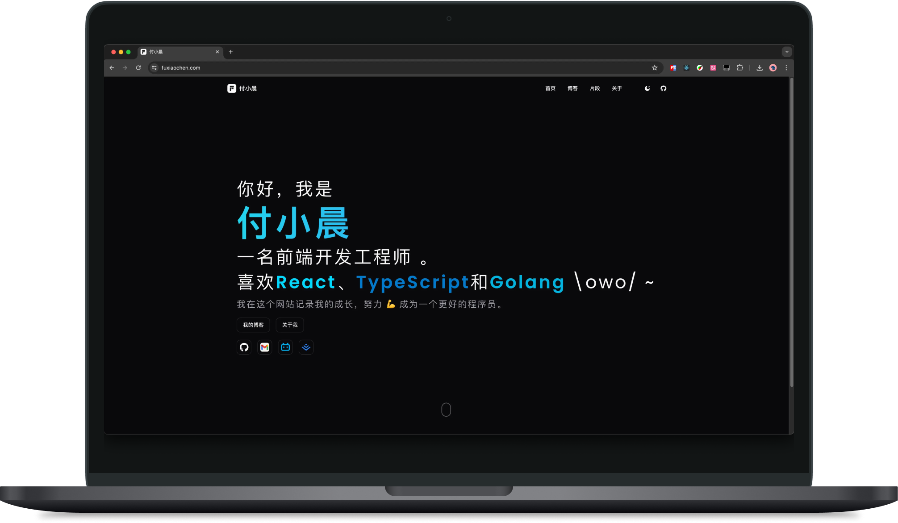
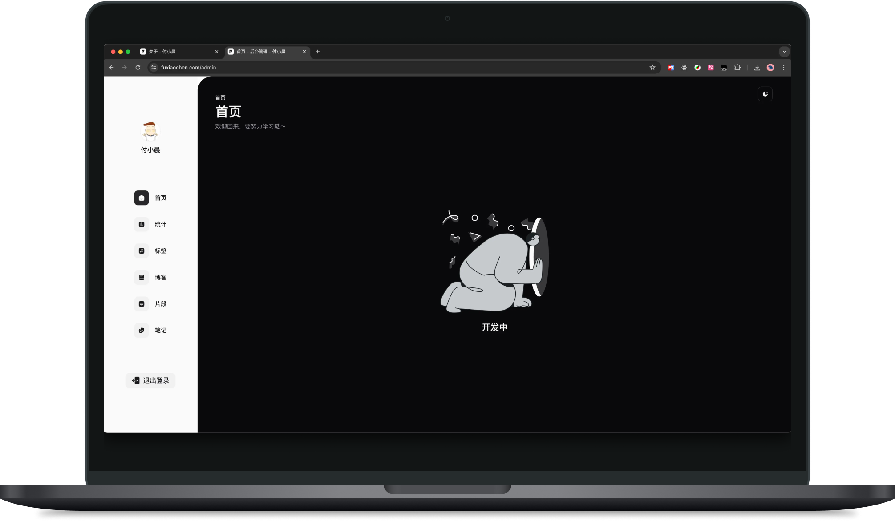
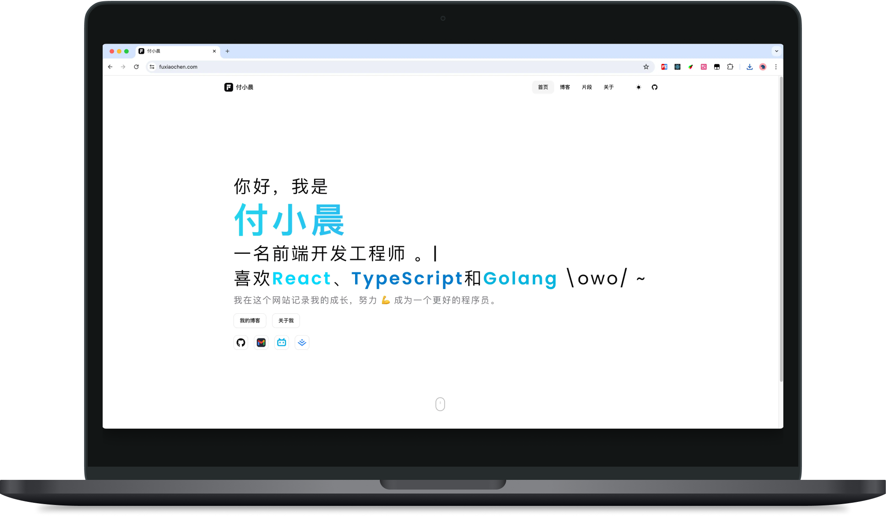
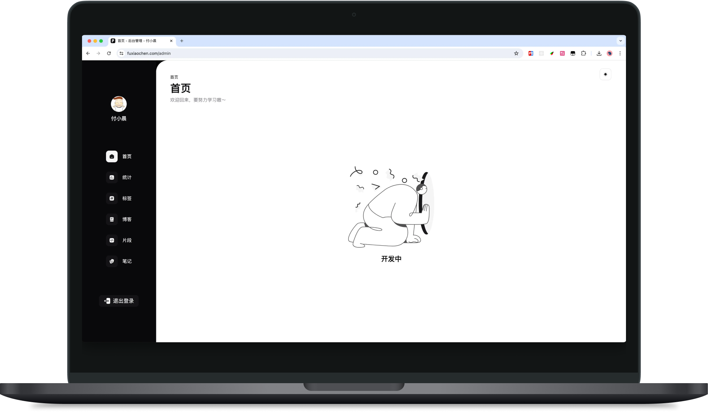

# <div align="center">fuxiaochen</div>

## 简介

一个简单的个人博客网站，使用 Next.js + React 18 + TypeScript + Shadcn/ui + Tailwind CSS 开发

## 预览

- PC端访问：https://fuxiaochen.com






- 移动端扫描👇下面二维码访问：

  

  

## 启动项目

```shell
# 1. 安装依赖
$ pnpm i

# 2. 准备数据库
$ pnpm db:push

# 3. 生成admin用户，默认相关配置在 .env.development 中
$ pnpm db:seed

# 4. 启动开发环境
$ pnpm dev
```

## 反馈

欢迎给我反馈，欢迎提 Issue

## 部署

...待补充

## 待补充

...待补充

## LICENCE

MIT
